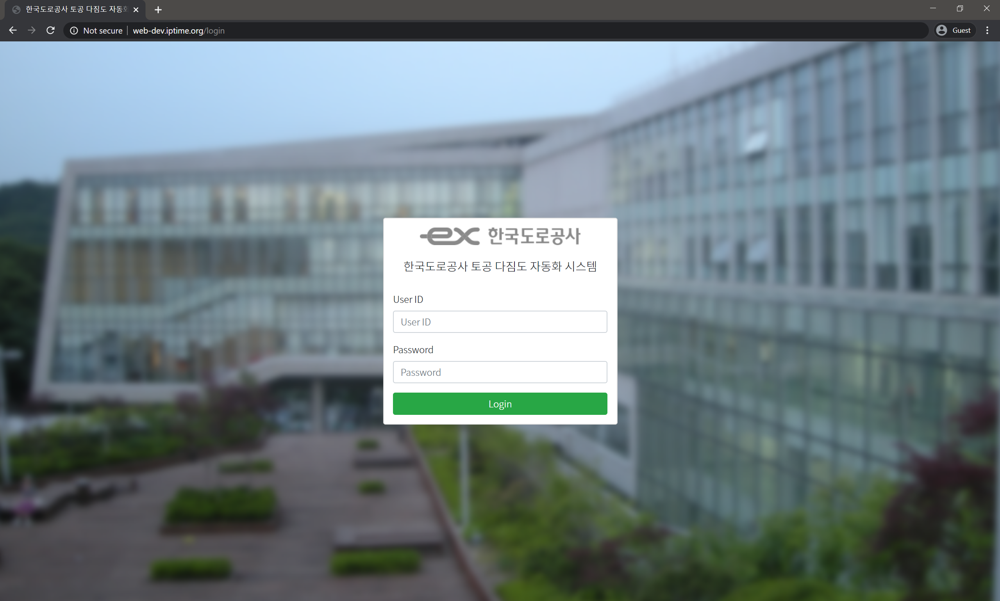
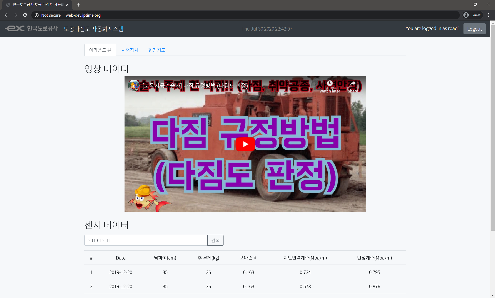
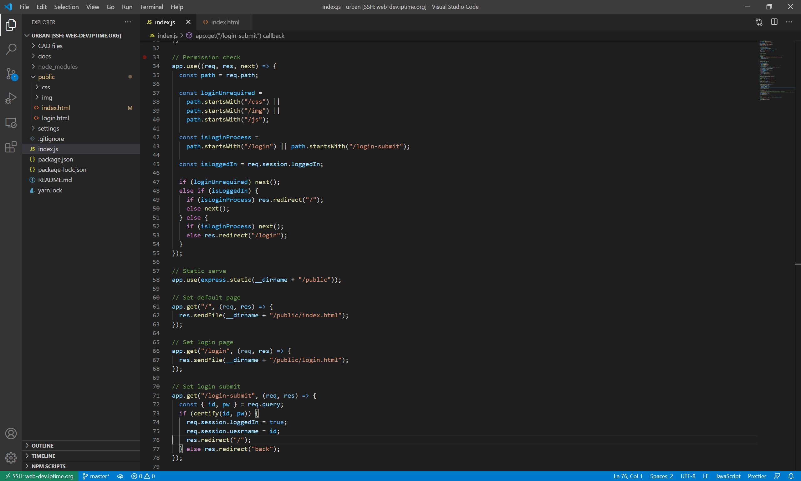

# 한국도로공사 토공 다짐도 자동화시스템 원격 서버

본 프로젝트는 한국도로공사의 토공 다짐도 자동화시스템의 원격 서버를 구축하는 것을 목표로 한다.

## 개발 목표

- 토공 다짐도 측정장비의 GPS / 로드셀 센서의 값을 받아 Database에 저장하고 Table에 표시
- 측정장비의 어라운드뷰 및 시험장비 뷰의 영상을 실시간으로 수신하여 웹페이지에서 확인
- 측정 위치를 미리 저장된 CAD파일 위에 표시
- 여러 유저가 로그인하여 각자 작업 환경을 살펴볼 수 있는 Multi-user system으로 구현
- 관리자는 관리하는 작업자의 시스템에 접근하여 작업 현장 확인 가능
- 데스크톱 / 태블릿 / 모바일에서 모두 사용 가능

## 개발 설명

- Backend(서버)는 Node.js 언어를 사용하며, Express 라이브러리를 사용하여 작동한다.
  - Node.js언어는 서버 개발에 특화된 언어이다.
  - Express는 Node.js언어로 안정적이고 빠른 서버를 구축할 수 있도록 도와주는 라이브러리다.
  - Express라이브러리의 장점은 뛰어난 확장성으로, 추후 여러가지 기능을 추가하기가 매우 용이하다.
- Frontend(웹페이지)는 Bootstrap과 React를 사용하여 구성하였다.
  - Bootstrap은 HTML을 사용하여 웹페이지를 구성할 때 일관적이고, 데스크탑과 모바일에서 둘 다 사용할 수 있는 화면을 구성할 수 있기 해 주는 라이브러리다.
  - React는 웹페이지 개발 시 중복되는 부분을 줄여주고, MVC 패턴이라는 개발 방법을 쉽게 적용할 수 있도록 해 주는 라이브러리(프레임워크)이다.
  - React는 웹페이지에 필요한 여러 데이터를 하나로 묶어주는 기능을 제공하여(Bundling이라고 함) React를 사용하면 웹페이지 로딩 속도가 빨라진다.
- 형상관리는 Git / GitHub을 이용하여 이루어진다.
  - 형상관리란 프로젝트의 변경사항을 체계적으로 추적하고 통제하는 것이다. (누가, 언제, 무엇을 바꾸었는지)
  - 특히 여러 사람이 하나의 개발 프로젝트를 진행할 때 형상관리를 하지 않으면 오류가 자주 발생하며, 해결하기 어렵다.
  - Git이란 이러한 형상관리 기능을 제공해주는 프로그램이다.
  - GitHub란 형상관리를 할 때 필요한 서버를 제공해주는 오픈소스 서비스다. 현재는 Microsoft가 운영하고 있다.

## 개발일지

#### 2020 / 07 / 01

- 개발 시작 / 환경설정

#### 2020 / 07 / 06

- 간단한 Node.js기반의 static 서버 작성

#### 2020 / 07 / 12

- Backend, Frontend 모두 간단한 로그인 구현 / UI / 메인 페이지 완성.
- 회원가입 시스템을 만드는 것은 난이도가 있을 듯.
  - 이야기해본 결과, 회원가입 시스템을 구태여 구성할 필요는 없으며, ID과 패스워드를 서버 측에서 발급하는 것으로 충분함.

#### 2020 / 07 / 15

- 깃허브 연동 완료

#### 2020 / 07 / 30

- 서버에 올려서 동작 시험 완료
- 반응형 웹페이지 구성 완료
- 기초적인 API 구성 및 JQuery를 사용한 API 요청 테스트 완료
- 지도 탭 등 여러 탭 구성 완료

#### 2020 / 08 / 29

- React 기반의 업데이트 시작
- React의 `Browser router`를 사용할 것이므로 라우팅은 클라이언트에서 하면 족하다. 서버는 오직 API만을 제공한다.
- Express를 사용하여 만든 서버는 React router처리를 자동으로 하지 않는다. 그러므로 세션이 없을 경우 login 페이지로 보내는 것으로 족하다.
- 원활한 개발을 위해 static server와 api server를 별도로 구현할 예정이다.
  - 이를 위해서는 로그인 구현 방법을 확실히 정해야 한다.
    1. 클라이언트가 ID, PW를 전송한다.
    2. 서버는 전송받은 ID, PW를 DB와 대조하여 올바른 사용자인지 확인한다.
    3. 올바른 사용자일 경우 서버는 세션을 생성한다.
    4. 추후 api를 통한 요청이 들어왔을 때 서버는 세션을 확인하여 인증된 사용자에게만 값을 돌려주고, 인증된 사용자가 아닐 경우 로그인 오류를 반환한다.
    5. 클라이언트는 로그인 오류를 반환받았을 경우 로그인 페이지로 리다이렉션하도록 한다.
  - 이러한 방법을 통하여 page-based가 아닌 api-based로 서버를 구현할 수 있다. 이 방법의 장점은 frontend와 backend가 완벽히 분리가능하여, 심지어 다른 서버에서 동작할 수도 있다는 점이다.
  - 다만 ajax를 사용하는 경우에도 세션이 잘 동작하는지 확인해볼 필요는 있다.
    - [Stack Overflow](https://stackoverflow.com/a/676941)답변을 보면 정상적으로 작동함을 알 수 있다.

## 추후 과제

- [ ] 카메라(rmtp) 연동
- [ ] GPS / 센서 값 등 DB에 저장할 수 있도록 API 구성
- [ ] GPS / 센서값 등 렌더링
- [ ] 지도 위치 지정 기능 구현
- [ ] 데이터 엑셀 파일로 다운로드 구현
- [ ] 녹화 기능 구현

## 개발 아이디어

- 지도 뷰를 만들 때, CAD파일 추가하기 / 삭제하기 버튼을 만들어 유저가 마음대로 추가 및 삭제할 수 있도록 하면 편리할 것 같다.
- Multer express middleware 라이브러리를 이용하면 간편하게 다룰 수 있다.
- 특히 이 지도 뷰를 캐러셀(carousel)로 구현하면 사용자가 매우 편리하게 사용할 수 있을 것 같다.

## 개발 스크린샷

#### 로그인 화면

#### 로그인 후 메인 화면

- 현재는 어라운드 뷰 및 시험장치 뷰 탭에 예시로 유튜브 영상이 올라와 있음.
- 기계와 연동하면 기계의 어라운드 카메라 및 시험장치 카메라가 해당 화면에 표시될 예정

#### 현장지도 화면

- 현재 표시되는 화면은 테스트용 이미지임.
- 실제로 개발 시 시험을 수행한 좌표가 이미지 위에 표시될 예정.

#### 모바일 테스트 화면

- 위 이미지는 Chrome 브라우저에서 제공하는 모바일 테스트 기능임.
- 우리가 제작한 웹페이지를 데스크톱 / 태블릿 / 스마트폰에서 모두 사용할 수 있도록 테스트 중.

#### Frontend(웹페이지) 개발 화면

#### Backend(웹서버) 개발 화면

- 웹서버에 원격으로 접속하여 개발을 수행하는 화면.
