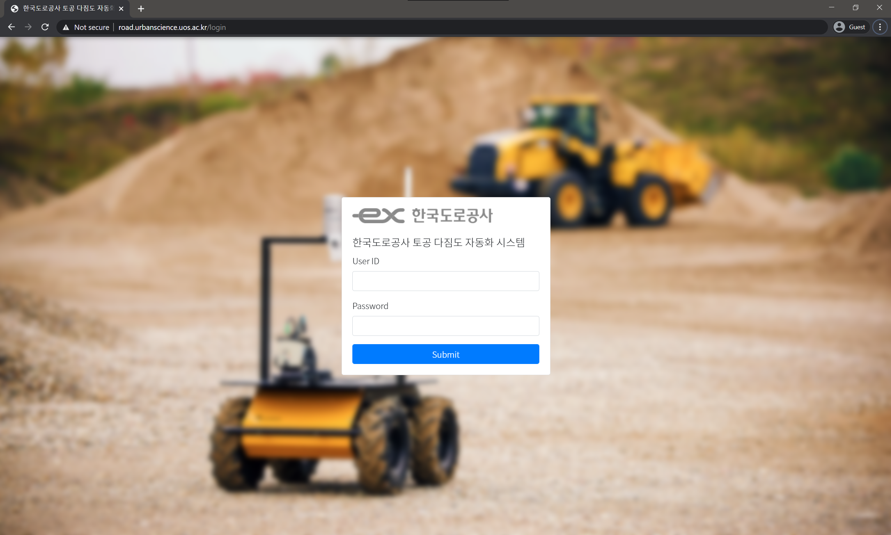
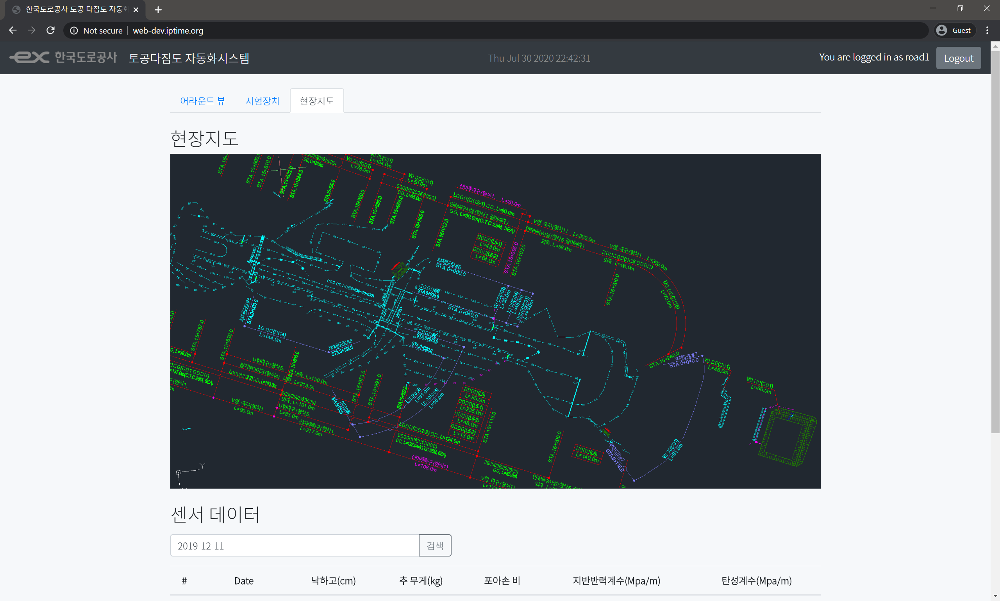
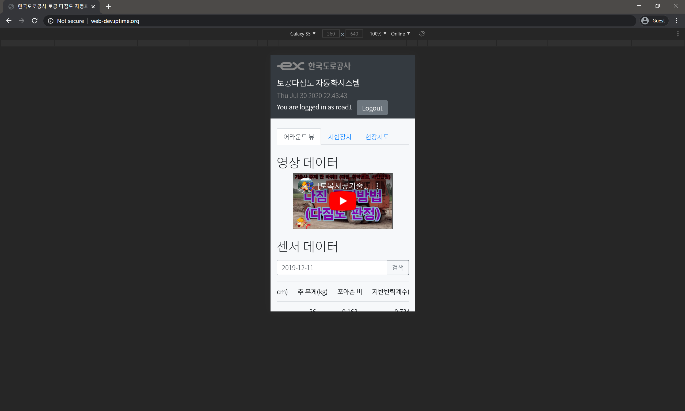
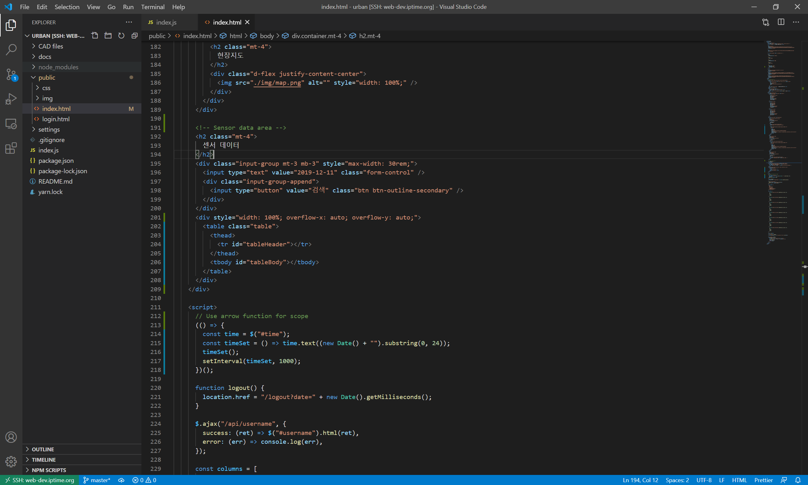

# 한국도로공사 토공 다짐도 자동화시스템 원격 서버

본 프로젝트는 한국도로공사의 토공 다짐도 자동화시스템의 원격 서버를 구축하는 것을 목표로 한다.

- 페이지 주소 : http://road.urbanscience.uos.ac.kr/login

## 개발 목표

- 토공 다짐도 측정장비의 GPS / 로드셀 센서의 값을 받아 Database에 저장하고 Table에 표시
- 측정장비의 어라운드뷰 및 시험장비 뷰의 영상을 실시간으로 수신하여 웹페이지에서 확인
- 측정 위치를 미리 저장된 CAD파일 위에 표시
- 여러 유저가 로그인하여 각자 작업 환경을 살펴볼 수 있는 Multi-user system으로 구현
- 관리자는 관리하는 작업자의 시스템에 접근하여 작업 현장 확인 가능
- 데스크톱 / 태블릿 / 모바일에서 모두 사용 가능

## 개발 설명

- Backend(서버)는 Node.js 언어를 사용하며, Express 라이브러리를 사용하여 작동한다.
  - Node.js언어는 서버 개발에 특화된 언어이다.
  - Express는 Node.js언어로 안정적이고 빠른 서버를 구축할 수 있도록 도와주는 라이브러리다.
  - Express라이브러리의 장점은 뛰어난 확장성으로, 추후 여러가지 기능을 추가하기가 매우 용이하다.
- Frontend(웹페이지)는 Bootstrap과 React를 사용하여 구성하였다.
  - Bootstrap은 HTML을 사용하여 웹페이지를 구성할 때 일관적이고, 데스크탑과 모바일에서 둘 다 사용할 수 있는 화면을 구성할 수 있기 해 주는 라이브러리다.
  - React는 웹페이지 개발 시 중복되는 부분을 줄여주고, MVC 패턴이라는 개발 방법을 쉽게 적용할 수 있도록 해 주는 라이브러리(프레임워크)이다.
  - React는 웹페이지에 필요한 여러 데이터를 하나로 묶어주는 기능을 제공하여(Bundling이라고 함) React를 사용하면 웹페이지 로딩 속도가 빨라진다.
- 형상관리는 Git / GitHub을 이용하여 이루어진다.
  - 형상관리란 프로젝트의 변경사항을 체계적으로 추적하고 통제하는 것이다. (누가, 언제, 무엇을, 왜 바꾸었는지)
  - 특히 여러 사람이 하나의 개발 프로젝트를 진행할 때 형상관리를 하지 않으면 오류가 자주 발생하며 해결하기 어렵다.
  - Git이란 이러한 형상관리 기능을 제공해주는 프로그램이다.
  - GitHub란 git으로 관리하는 내용을 저장할 수 있는 원격 서버를 제공해주는 서비스다. 현재는 Microsoft사가 운영하고 있다.

## 개발일지

#### 2020 / 07 / 01

- 개발 시작 / 환경설정

#### 2020 / 07 / 06

- 간단한 Node.js기반의 static 서버 작성

#### 2020 / 07 / 12

- Backend, Frontend 모두 간단한 로그인 구현 / UI / 메인 페이지 완성.
- 회원가입 시스템을 만드는 것은 난이도가 있을 듯.
  - 이야기해본 결과, 회원가입 시스템을 구성할 필요는 없으며, ID과 패스워드를 운영자가 발급하는 것으로 충분함.

#### 2020 / 07 / 15

- 깃허브 연동 완료

#### 2020 / 07 / 30

- 서버에 올려서 동작 시험 완료
- 반응형 웹페이지 구성 완료
- 기초적인 API 구성 및 JQuery를 사용한 API 요청 테스트 완료
- 지도 탭 등 여러 탭 구성 완료

#### 2020 / 08 / 28

- React 기반의 업데이트 시작
- React의 `Browser router`를 사용할 것이므로 라우팅은 클라이언트에서 하면 족하다. 서버는 오직 API만을 제공한다.
- Express를 사용하여 만든 서버는 React router처리를 자동으로 하지 않는다. 그러므로 세션이 없을 경우 login 페이지로 보내는 것으로 족하다.
- 원활한 개발을 위해 static server와 api server를 별도로 구현할 예정이다.
  - 이를 위해서는 로그인 구현 방법을 확실히 정해야 한다.
    1. 클라이언트가 ID, PW를 전송한다.
    2. 서버는 전송받은 ID, PW를 DB와 대조하여 올바른 사용자인지 확인한다.
    3. 올바른 사용자일 경우 서버는 세션을 생성한다.
    4. 추후 api를 통한 요청이 들어왔을 때 서버는 세션을 확인하여 인증된 사용자에게만 값을 돌려주고, 인증된 사용자가 아닐 경우 로그인 오류를 반환한다.
    5. 클라이언트는 로그인 오류를 반환받았을 경우 로그인 페이지로 리다이렉션하도록 한다.
  - 이러한 방법을 통하여 page-based가 아닌 api-based로 서버를 구현할 수 있다. 이 방법의 장점은 frontend와 backend가 완벽히 분리가능하여, 심지어 다른 서버에서 동작할 수도 있다는 점이다.
  - 다만 ajax를 사용하는 경우에도 세션이 잘 동작하는지 확인해볼 필요는 있다.
    - [Stack Overflow](https://stackoverflow.com/a/676941)답변을 보면 정상적으로 작동함을 알 수 있다.

#### 2020 / 08 / 29

- axios 라이브러리를 사용할 예정인데, 별도로 설정하지 않는 한 세션이 제대로 작동하지 않을 것으로 보인다. 어떻게 하면 좋을까?
- 아래와 같이 token-based 로그인을 시도한다.
  1. 클라이언트가 ID, PW를 전송한다.
  2. 서버는 전송받은 ID, PW를 DB와 대조하여 올바른 사용자인지 확인한다.
  3. 올바른 사용자일 경우 서버는 해당 유저를 위한 token을 생성한다.
  4. 서버는 User-Token-ExpireDate 튜플을 저장하여 로그인 정보를 기록한다.
  5. 이후 Token이 클라이언트에게 전달된다.
  6. 이후 클라이언트는 해당 KEY를 사용하여 서버에 api요청을 보낸다.
  7. 서버는 매 요청마다 DB의 ExpireDate를 갱신하고, 만약 token이 Expire되었다면 폐기한다.
- 실제로는 하나의 계정으로 여러 기기에서 접속할 수 있기 때문에, Token-ExpireDate 저장 부분과 User-Token 저장 부분을 나누어 구현하였다.
- Context개념을 약간 이해하게 됐다.

#### 2020 / 09 / 01

- pdf를 이미지로 변환하여 웹에 표시하는 것을 시작
- Node.js 라이브러리를 사용하려고 했으나 원하는 대로 동작하지 않아 [pdf2image](https://pypi.org/project/pdf2image/) 파이썬 라이브러리를 이용하기로 결정.

#### 2020 / 09 / 02

- pdf를 이미지로 변환하여 웹에 표시하는 것을 완료
- pdf2image 파이썬 라이브러리를 사용하여 `CAD files` 디렉토리 내에 있는 `pdf`파일들을 이미지로 변환하여 `public/img/cad`디렉토리에 저장.
- 이후 클라이언트단에서 `axios` 라이브러리로 api 서버에 `ajax`요청을 하여 파일 메타데이터를 받아오도록 구성.
- 클라이언트는 서버로부터 받은 메타데이터로부터 이미지 로딩 등 여러 요청을 수행함.

#### 2020 / 09 / 19

- 웹페이지에 표시되는 데이터(GPS/로드셀 값 등)을 CSV파일로 Export할 수 있는 기능 구현 완료

#### 2020 / 10 / 14

- 포트 설정 완료

#### 2020 / 10 / 20

- 프로젝트 구조 개편

#### 2020 / 10 / 26

- 로그아웃 구현
- 디버그용 계정 삭제
- 한 서버에 다중 서비스를 올림으로 인한 페이지 설정

#### 2020 / 11 / 03

- 전산정보과에 연락하여 연구실 서버에 여러 서비스를 올릴 수 있도록 와일드카드 도메인 설정
  - 와일드카드 도메인이란, 한 서버에서 서로 다른 도메인(웹 주소)를 사용할 수 있도록 하는 것임.
  - 새롭게 업데이트한 우리 연구실 서버의 도메인은 `*.urbanscience.uos.ac.kr`로, 이제 `아무거나.urbanscience.uos.ac.kr`, `service.serviceof.urbanscience.uos.ac.kr` 등 `*`부분에 아무 문자열을 입력해도 우리 서버로 접속됨.
- 서버 내부에서는 외부에서 80번 포트로 들어온 연결을 도메인에 따라 서버 내부의 다른 포트에 할당된 서비스로 포워딩함. 이를 `리버스 프록시`라고 함.
  - 리버스 프록시를 구현하기 위해, `NGINX`라는 프로그램을 사용하고 있음.

#### 2020 / 11 / 04

- UI 업데이트하여 테이블 추가
- 연구실 웹 기본 페이지 구현
  - 기존에는 잘못된 서브도메인으로 접속할 경우 `NGINX`기본 페이지가 표시되었는데, 이 페이지를 업데이트함.

#### 2020 / 11 / 06

- Pivot이 서버와 연동되고 화면에 표시되게 구현
- CAD viewer를 functional component로 포팅하려다가 설계를 잘못하여 실패하고 롤백함.

#### 2020 / 11 / 09

- 이미지/스트림 업로드 기능 개발 시작
  - FFMPEG동작 여부 보고 동작 안 되면 이미지로 구현하기로 결정.
  - FFMPEG가 생각만큼 잘 동작하지 않아 이미지 기반으로 구현 시작
  - 개발 결과, 스트리밍이 잘 이루어짐. 현재는 라우팅을 한 개만 사용하여 하나의 카메라로부터 영상을 수신함. 추후 path param을 사용하여 다중 카메라의 경우에도 스트리밍이 가능하도록 구현할 필요 있음.
  - 현재 시스템은 이미지와 영상을 구분하지 않으므로, 시스템을 건드리지 않고 이미지 베이스 구현을 영상 베이스로 바꿀 수 있음.
- 비디오 표시 화면이 가로 폭이 좁을 경우 세로로 표시되도록 반응형 페이지 구현

#### 2020 / 11 / 16

- CadViewer 캘리브레이션 작업 시작
- 행렬식이 잘못되었는지 지속적으로 오류 발생

#### 2020 / 11 / 18

- Calibration 계산 문제를 해결함.
- 이전에는 Calibration을 구현할 때 고차함수를 메서드로 가지는 클래스를 state에 집어넣어 비효율적이고 복잡했음. 이를 단순 dictionary 및 pure-function만을 사용하도록 refactor 함.
- CadViewer안에 들어있던 여러 컴포넌트들을 파일로 분리
- 가독성을 높이기 위해 커서 텍스트에 검은색 박스 추가
- ES6파일과 컴포넌트 구분을 명확히 하기 위해 확장자를 `jsx`로 업데이트

#### 2020 / 11 / 19

- 데이터베이스 재구축
- NF1은 당연히 수행
- `sections` relation에서 NF2가 제대로 수행되지 않았음. 그러나 굳이 NF2를 할 필요가 있는지 의문.
- 기존 프론트에 dummy 데이터로 들어있었던 센서 데이터를 데이터베이스에 연결함.

#### 2020 / 11 / 21

- 데이터 포인트 표시하도록 구현

#### 2020 / 11 / 22

- 캘리브레이션 포인트 설정이 덜 되었을 경우 경고 알림 띄우도록 설정
- 스냅샷 UI추가

#### 2020 / 11 / 24

- 데이터 다운로드 기능 오류 수정

#### 2020 / 11 / 26

- 서버로 센서 데이터 전송 구현
- GPS연동 재확인해볼 필요 있음

#### 2020 / 11 / 27

- 다중 카메라 스트리밍 구현
  - Image 클래스로 로딩 후 단순히 canvas에서 다른 위치에 그리도록 구현함.
  - 생각보다 전송 속도가 빠르며, 레이턴시도 적고, 구현도 단순하다. 복잡한 HLS streaming보다 우수한 듯.
- 센서 측정 포인트를 검사하여 조건에 맞지 않을 경우 하이라이팅하는 기능 구현
- 센서 측정 포인트 Tooltip 업데이트

#### 2020 / 12 / 01

- 카메라 스트리밍을 / 파일 업로드 / GPS연동 / 데이터 표시 등 모든 장비 확인 완료
- 다만 지금 당장은 알 수 없는 이유로 GPS기기를 통한 인터넷 사용이 어려우므로, 현장에서는 셀룰러 데이터가 필요할 것으로 생각됨.
  - GNSS업체 연구원님께 여쭤 본 결과 SIM 칩이 특정 장비에서만 동작하게 설정되어있는 경우가 있어 그 문제일 수 있다고 함.

## 추후 과제

- [ ] 카메라(rmtp) 연동
- [ ] GPS / 센서 값 등 DB에 저장할 수 있도록 API 구성
- [ ] GPS / 센서값 등 렌더링
- [ ] 지도 위치 지정 기능 구현
- [ ] 녹화 기능 구현

## 개발 아이디어

- 지도 뷰를 만들 때, CAD파일 추가하기 / 삭제하기 버튼을 만들어 유저가 마음대로 추가 및 삭제할 수 있도록 하면 편리할 것 같다.
- Multer express middleware 라이브러리를 이용하면 간편하게 다룰 수 있다.
- 특히 이 지도 뷰를 캐러셀(carousel)로 구현하면 사용자가 매우 편리하게 사용할 수 있을 것 같다.

## 개발 스크린샷

#### 로그인 화면

#### 로그인 후 메인 화면

- 현재는 어라운드 뷰 및 시험장치 뷰 탭에 예시로 유튜브 영상이 올라와 있음.
- 기계와 연동하면 기계의 어라운드 카메라 및 시험장치 카메라가 해당 화면에 표시될 예정

#### 현장지도 화면

- 현재 표시되는 화면은 테스트용 이미지임.
- 실제로 개발 시 시험을 수행한 좌표가 이미지 위에 표시될 예정.

#### 모바일 테스트 화면

- 위 이미지는 Chrome 브라우저에서 제공하는 모바일 테스트 기능임.
- 우리가 제작한 웹페이지를 데스크톱 / 태블릿 / 스마트폰에서 모두 사용할 수 있도록 테스트 중.

#### 개발 화면

- 위와 같이 웹서버에 원격으로 접속하여 개발을 수행한다.