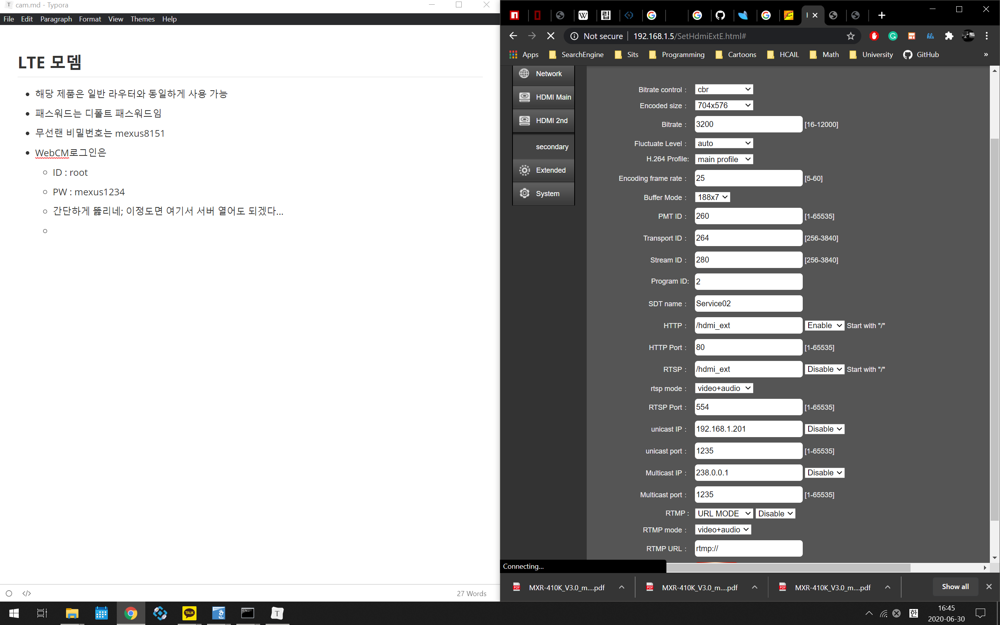

## LTE 모뎀

- 해당 제품은 일반 라우터와 동일하게 사용 가능
- 패스워드는 디폴트 패스워드임
- 무선랜 비밀번호는 mexus8151
- 웹 관리자 페이지 로그인은
  - ID : root
  - PW : mexus1234

## 카메라 인코더 모듈

- 
- 인코더 모듈의 IP는 확인해본 바 192.168.0.2, 192.168.0.5로 돼 있다.
  - 이는 디바이스 아랫면에 써져 있는 IP와는 다른 값이다.
  - 만약 IP가 가변이어서 접속이 안 될 경우, IP 스캐닝을 통하여 열린 아이피를 찾으면 된다.
- http://www.hwcodec.com/product/h8110p/
  - 정확하게는 이 제품인 듯하다.