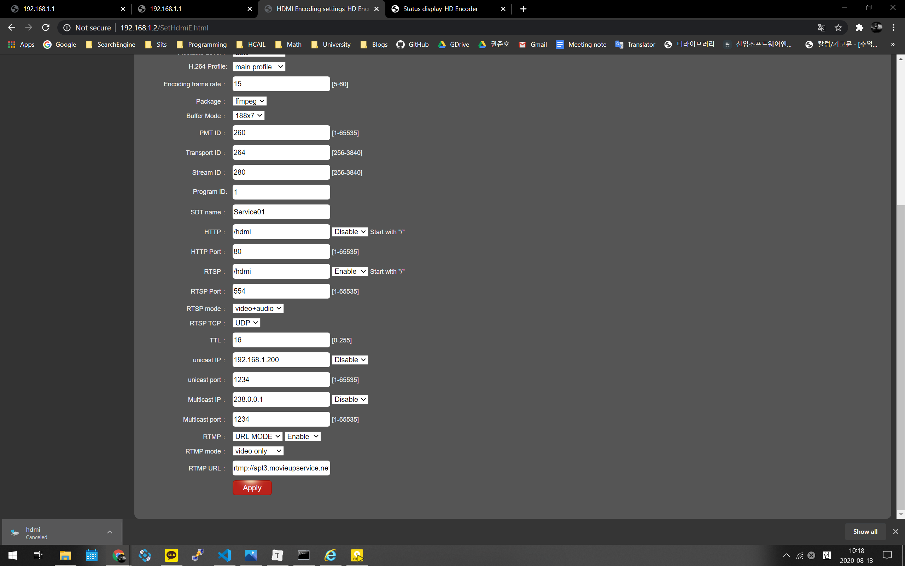
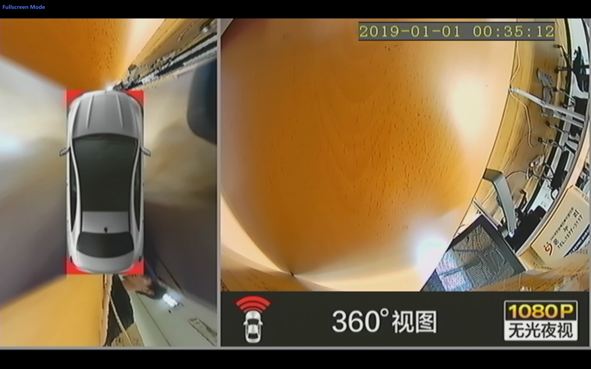
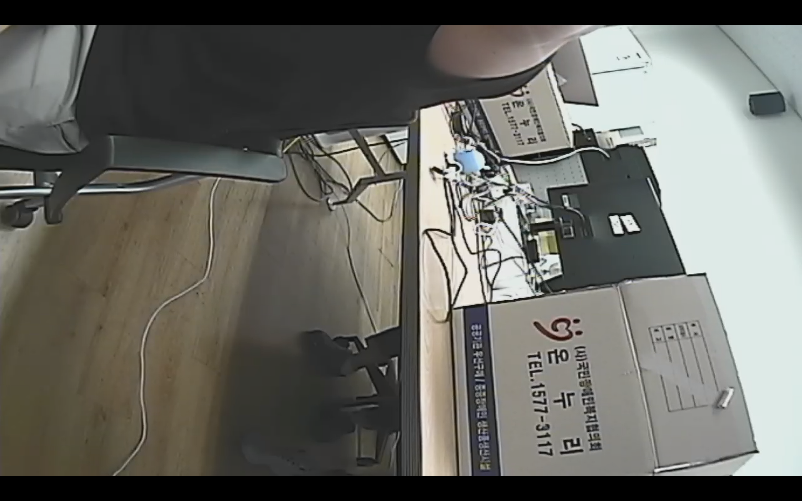

## LTE 모뎀

- 해당 제품은 일반 라우터와 동일하게 사용 가능
- 패스워드는 디폴트 패스워드를 사용한다.
- 무선랜 비밀번호는 mexus8151
- 웹 관리자 페이지 로그인은
  - ID : root
  - PW : mexus1234

## 카메라 인코더 모듈

- 인코더 모듈의 IP는 확인해본 바 `192.168.1.2`, `192.168.1.5`로 돼 있다.
  - 이는 디바이스 아랫면에 써져 있는 IP와는 다른 값이다.
  - 혹시 아이피가 변동되었을 경우, 공유기에 접속된 아이피를 공유기 페이지에서 확인 가능하다.
- 접속하려면 ID / PW가 필요한데, 디바이스 아랫면에 적혀 있다.
- http://www.hwcodec.com/product/h8110p/
  - 정확하게는 이 제품인 듯하다.
- 다음 팟플레이어를 사용하여 `rtsp://192.168.1.2/hdmi`에 접속해본 결과 접속이 잘 되었다. ~~다만 영상은 송출되지 않고, 파란색 화면만을 볼 수 있었다. 아래 언급할 전압 문제일 수 있으므로, 배터리를 충전한 후 재시도해볼 필요가 있다.~~ 전압 문제임이 확인되었다.

## 배터리

- 오랫동안 사용하지 않았더니 방전되었다. 버튼을 눌러도 전원이 들어오지 않았다. 주기적으로 충전해 줄 필요가 있어보인다.
- 방전되고 나서 충전기를 연결한 후 전원을 켜 봤으나, LTE 모뎀이 정상적으로 동작하지 않았다. 배터리 잔량이 부족한 상태에서 너무 많은 기기를 한 번에 연결하여 voltage drop이 발생한 것으로 생각된다.
- 5분정도 충전한 후 사용해보니 모든 기기가 잘 작동하였으나, 모뎀이 가끔 연결이 끊어졌다. 부하가 큰 작업이 이뤄져서 그런 것으로 보인다.

## 카메라

### 어라운드 뷰

### CCTV 카메라

둘 다 잘 작동함. 아마도 배터리 문제였던 것으로 생각됨.

## GPS(GNSS)

- **WGS84 타원체**
  - 입력 row data format.
- GIS 80 타원체
  - 비교적 최근에 만들어진 모델
  - 직각좌표계와 호환될 듯.
- 베셀 타원체
  - 오래전에 개발된 모델이라 부정확할 수 있음 캘리브레이션 요구됨.
- Korean TM 
- EPSG code
- 규격은 [NMEA0183](https://en.wikipedia.org/wiki/NMEA_0183)을 따름.
- 전송되는 데이터 중 GPGGA 필드만 체크하면 된다.
  - 입력 데이터 : 시간 / 위도 / 경도 / 고도
  - 예시 데이터: `GPGGA,114455.532,3735.0079,N,12701.6446,E,1,03,7.9,48.8,M,19.6,M,0.0,0000*48`
- 고도 편차를 보정하려면 EGM geoid model 참조.
- Earth Gravitational Models

